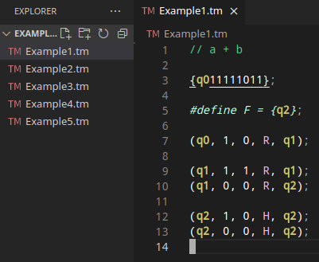

# Turing Machine language support for Visual Studio Code
This extension enables syntax highlighting for .tm files

Check out the [Turing Machine Simulator](https://github.com/margual56/TuringMachine)

## Features

Syntax Highlighting and file icons.

## Release Notes

### 1.0.0

Initial extension support
